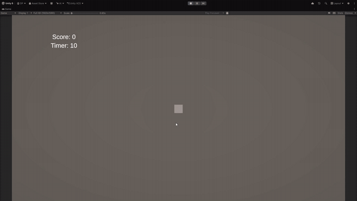

# ECS-Unity-Simple

Учебный проект для знакомства с **Unity DOTS / ECS (Entities 1.x)**. Это мини-игра «Сборщик»: кубик ездит по полю и за 10 секунд собирает как можно больше монет, которые появляются в случайных точках.



## Справочник

Игра написана по справочнику «Unity DOTS — справочник для первого проекта» ([HTML](Docs/DOTS-first-project.html) · [PDF](Docs/DOTS-first-project.pdf)). Готового кода в нём нет. Каждый шаг описывает, что должно заработать, какие файлы создать и из каких конструкций API это собрать, а код пишешь сам. После каждого шага игра запускается и что-то делает.

| Шаг | Тема | Что изучается |
|---|---|---|
| 1 | Подготовка проекта | Entities Graphics, SubScene, окна Entities Hierarchy / Systems |
| 2 | Компоненты данных | `IComponentData`, теги, синглтоны, blittable-типы |
| 3 | Игрок на сцене | Authoring-компоненты, `Baker`, `TransformUsageFlags` |
| 4 | Движение по WASD | `ISystem`, `SystemAPI.Query`, `RefRW` / `RefRO`, `LocalTransform` |
| 5 | Спавн монеток | Запекание префаба, `EntityCommandBuffer`, `Unity.Mathematics.Random` |
| 6 | Подбор и счёт | `GetSingletonRW`, `WithEntityAccess`, удаление через ECB |
| 7 | UI | Связь MonoBehaviour ↔ ECS через `EntityManager` и `EntityQuery` |
| 8 | Конец игры и рестарт | Глобальное состояние в синглтоне, сброс всех изменяемых данных |

Кроме шагов, в справочнике есть три приложения: обратный указатель «хочу сделать X → какая конструкция», расшифровка типичных ошибок ECS и инструменты отладки.

Jobs, Burst, пулы и физика в справочнике намеренно не рассматриваются: они про производительность, а не про саму концепцию ECS. Поэтому вся логика работает на главном потоке.

## Геймплей

- **WASD / стрелки**: движение игрока (куб) по полю 20×20.
- Монеты появляются с заданным интервалом в случайной позиции.
- Если подойти к монете ближе чем на 1 единицу, монета подбирается и счёт растёт на 1.
- Когда таймер доходит до нуля, игра останавливается и показывается окно с итоговым счётом и кнопкой **Restart**.

## Стек

| | |
|---|---|
| Unity | 6000.5.7f1 |
| Entities / Entities Graphics | 6.5.0 |
| Render Pipeline | URP 17.5 |
| UI | uGUI + TextMeshPro |

## Структура

```
Assets/Scripts/
├── Components/   // IComponentData: данные без логики
├── Authoring/    // MonoBehaviour + Baker: конвертация GameObject → Entity
├── System/       // ISystem: вся игровая логика
└── UI/           // MonoBehaviour-мост между ECS и Canvas
```

Игровые объекты (игрок, спавнер) лежат в **SubScene** `MainSubScene` и запекаются в сущности. UI остаётся в обычной сцене.

## Детали реализации

**Компоненты**: `PlayerTag` и `CoinTag` (теги без данных), `Speed`, `SpawnerData` (префаб, интервал, таймер, `Unity.Mathematics.Random`), а также синглтоны `Score`, `GameTimer` и `GameState`.

**Authoring + Baker**: `PlayerAuthoring`, `CoinAuthoring` и `SpawnerAuthoring` переносят значения из инспектора в компоненты. `SpawnerAuthoring` через `GetEntity(prefab, ...)` превращает префаб монеты в Entity-префаб.

**Системы** (все `partial struct : ISystem`):

| Система | Что делает | Что демонстрирует |
|---|---|---|
| `PlayerMoveSystem` | Двигает игрока по вводу и ограничивает его границами поля | `SystemAPI.Query<RefRW<>, RefRO<>>().WithAll<>()`, `SystemAPI.Time` |
| `CoinSpawnSystem` | По таймеру создаёт монету в случайной точке | `EntityCommandBuffer` из `BeginSimulationEntityCommandBufferSystem`, `Random` внутри компонента |
| `CoinPickupSystem` | Проверяет дистанцию до монет, удаляет подобранную, увеличивает счёт | `WithEntityAccess()`, отложенное удаление через ECB, `GetSingletonRW` |
| `GameTimerSystem` | Ведёт обратный отсчёт и выставляет `GameState.IsOver` | Синглтон-сущность, созданная в `OnCreate` |
| `GameRestartSystem` | По запросу сбрасывает счёт, таймер и позицию игрока, удаляет монеты | Управление состоянием игры через данные, а не через вызовы методов |

**Связь UI ↔ ECS**: `GameHud` (MonoBehaviour) получает `EntityManager` из `World.DefaultGameObjectInjectionWorld` и читает `Score` / `GameTimer` через `EntityQuery`. Кнопка **Restart** не вызывает логику напрямую: она только выставляет флаг `GameState.RestartRequest`, а сброс выполняет `GameRestartSystem`.

## Запуск

1. Открыть проект в Unity **6000.5.7f1** (или новее из ветки 6000.5).
2. Открыть сцену `Assets/Scenes/SampleScene.unity`.
3. Нажать **Play**.

## Что дальше

Следующие темы, которые справочник рекомендует после этого проекта:

- `IJobEntity` и `[BurstCompile]`: та же логика, но в несколько потоков;
- `IEnableableComponent` и пулы вместо создания и удаления сущностей каждую секунду;
- группы систем и явный порядок выполнения через `[UpdateBefore]` / `[UpdateAfter]`;
- `IBufferElementData` для передачи событий из ECS в UI и звук.

## Лицензия

[LICENSE](LICENSE)
